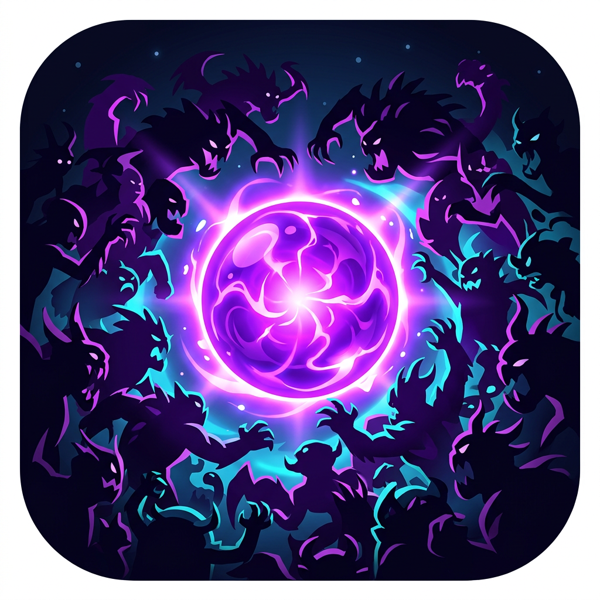

# Endless Onslaught 无尽猛攻

<p align="center">
  
</p>

<p align="center">
  <b>English</b> | <a href="#中文">中文</a>
</p>

A fast-paced 2D roguelite survivor game (vampire-survivors-like), built from scratch with **TypeScript + HTML5 Canvas + Vite** — no game engine, no frameworks.

Survive an endless, ever-growing monster onslaught. Level up, pick from 9 weapons and 10 passives, and see how long you can last.

## 🎮 Download & Play

Grab the Windows portable exe from [**Releases**](https://github.com/Riddim004/Endless-onslaught-Rogue/releases) — no installation needed, just double-click and play.

## ✨ Features

- **9 weapons**: homing bolts, roaming daggers, orbiting orbs, flame aura, frost nova, chain lightning, frost field, gravity singularity, shockwave
- **10 passives**: damage, attack speed, area, move speed and more — several with **no level cap**
- **Endless difficulty**: enemy HP (up to 30×), speed (3×) and spawn rate (10×) ramp up over 10 minutes, then it's pure survival
- **Stampede events**: clusters of 50–100 monsters periodically sweep across the screen
- **Minute bosses**: a boss spawns every minute with growing HP
- **Full-screen pickup**, crit builds up to 100%, one free re-roll per level-up

## 🕹️ Controls

| Key | Action |
|---|---|
| `WASD` / Arrow keys | Move |
| `P` / `Esc` | Pause |
| Mouse | Pick level-up choices |

Weapons fire automatically — your job is to dodge, position, and build.

## 🛠️ Development

```bash
npm install       # install dependencies
npm run dev       # dev server (http://localhost:5173, hot reload)
npm run build     # type-check + production build to dist/
npm run dist:exe  # package the Windows portable exe (output: release/)
```

> Building the exe downloads the Electron runtime. In mainland China, set the mirror first:
> `$env:ELECTRON_MIRROR='https://npmmirror.com/mirrors/electron/'`

## ⚖️ Tuning the Game

All gameplay numbers live in a single file: [`src/game/config.ts`](src/game/config.ts) — player stats, XP curve, difficulty ramp, enemy stats, passives, and every weapon's per-level arrays. Edit, save, and the dev server hot-reloads instantly.

## 📁 Project Structure

```
src/
├── main.ts             # entry point
└── game/
    ├── config.ts       # ★ all gameplay tuning in one place
    ├── game.ts         # main loop, collisions, XP & level-up flow
    ├── skills.ts       # weapon & passive definitions
    ├── spawner.ts      # enemy waves, difficulty ramp, bosses, stampedes
    ├── entities.ts     # player / enemy / projectile factories
    ├── renderer.ts     # canvas rendering & visual effects
    ├── input.ts        # keyboard input
    ├── ui.ts           # HUD & level-up screens
    └── math.ts         # small math helpers
```

---

<a name="中文"></a>

# 中文

一款快节奏的 2D 肉鸽幸存者游戏（类吸血鬼幸存者），使用 **TypeScript + HTML5 Canvas + Vite** 从零编写——没有游戏引擎，没有框架。

在无穷无尽、不断变强的怪物狂潮中求生。升级、从 9 种武器和 10 种被动中构筑你的 Build，看看你能活多久。

## 🎮 下载游玩

从 [**Releases**](https://github.com/Riddim004/Endless-onslaught-Rogue/releases) 下载 Windows 便携版 exe——无需安装，双击即玩。

## ✨ 特性

- **9 种武器**：追踪飞弹、乱飞回旋刀、守护法球、烈焰领域、冰霜新星、连锁闪电、霜寒领域、重力奇点、震荡波
- **10 种被动**：伤害、攻速、范围、移速等——其中多项**没有等级上限**
- **无尽难度**：怪物血量（最高 30 倍）、移速（3 倍）、出怪速度（10 倍）在 10 分钟内持续攀升，之后就是纯粹的生存考验
- **踩踏事件**：每隔一段时间，50–100 只怪物组成的兽群横扫屏幕
- **每分钟 Boss**：每分钟刷新一个血量递增的 Boss
- **全屏拾取**、暴击可堆到 100%、每次升级有一次免费刷新选项

## 🕹️ 操作

| 按键 | 功能 |
|---|---|
| `WASD` / 方向键 | 移动 |
| `P` / `Esc` | 暂停 |
| 鼠标 | 选择升级选项 |

武器全自动攻击——你要做的是走位、拉扯和构筑。

## 🛠️ 开发

```bash
npm install       # 安装依赖
npm run dev       # 开发服务器（http://localhost:5173，热重载）
npm run build     # 类型检查 + 生产构建到 dist/
npm run dist:exe  # 打包 Windows 便携版 exe（输出到 release/）
```

> 打包 exe 需要下载 Electron 运行时，国内网络请先设置镜像：
> `$env:ELECTRON_MIRROR='https://npmmirror.com/mirrors/electron/'`

## ⚖️ 调整数值

所有游戏数值集中在一个文件里：[`src/game/config.ts`](src/game/config.ts)——玩家属性、经验曲线、难度爬升、怪物数值、被动效果、以及每种武器逐级的数值数组。改完保存，开发服务器立即热重载生效。

## 📁 项目结构

```
src/
├── main.ts             # 入口
└── game/
    ├── config.ts       # ★ 所有可调数值集中于此
    ├── game.ts         # 主循环、碰撞、经验与升级流程
    ├── skills.ts       # 武器与被动定义
    ├── spawner.ts      # 出怪波次、难度爬升、Boss、踩踏事件
    ├── entities.ts     # 玩家/怪物/投射物工厂
    ├── renderer.ts     # Canvas 渲染与特效
    ├── input.ts        # 键盘输入
    ├── ui.ts           # HUD 与升级界面
    └── math.ts         # 数学工具函数
```
